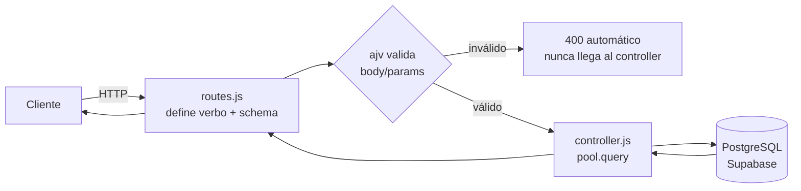
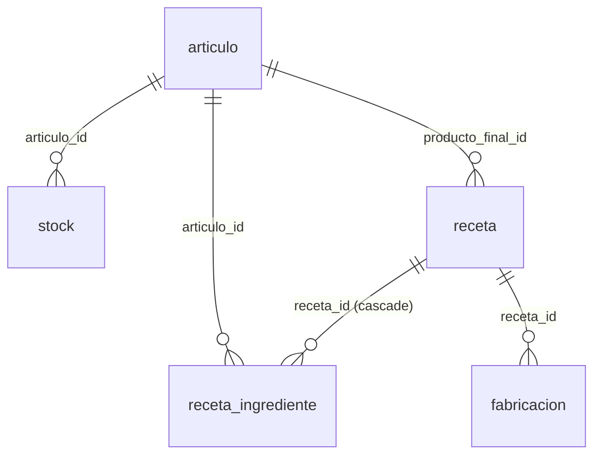
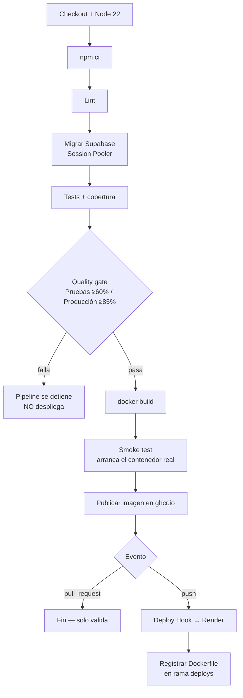

# api-fastify

API REST/QUERY para la gestión de producción y materiales. Construida con **Fastify 5**, **TypeBox**, **PostgreSQL (Supabase)**, empaquetada con **Docker** y desplegada mediante **2 pipelines de CI/CD independientes en GitHub Actions** hacia **Render**.

- **Repositorio:** https://github.com/BETO1274/api-fastify
- **Ramas:** `test` (desarrollo) → Pull Request → `produccion` (default)
- **Ambientes desplegados:**
  - Test: https://api-fastify-ce3a.onrender.com
  - Producción: https://api-fastify-produccion.onrender.com
- **Documentación interactiva (Swagger UI):** agregar `/docs` a cualquiera de las dos URLs.

---

## Stack tecnológico

| Capa | Tecnología |
|---|---|
| Servidor web | Fastify 5 |
| Lenguaje | JavaScript (ESM) |
| Validación | TypeBox → JSON Schema → `ajv` (nativo de Fastify) |
| Base de datos | PostgreSQL (Supabase), driver `pg` |
| Control de versiones de BD | Supabase CLI (migraciones en `supabase/migrations/`) |
| Documentación de la API | `@fastify/swagger` + `@fastify/swagger-ui` |
| Pruebas | Vitest + `fastify.inject()` (integración, sin mocks, contra BD real) |
| Contenedor | Docker (`node:22-alpine`, usuario no-root) |
| CI/CD | GitHub Actions (2 pipelines) |
| Hosting | Render (Web Services, 2 ambientes aislados) |
| Registro de imágenes | GitHub Container Registry (ghcr.io) |

---

## Arquitectura

### Estructura de carpetas (modular por características)

```
src/
├── app.js                        # Composición: registra plugins, módulos y el error handler
├── server.js                     # Único archivo que llama app.listen()
├── config/
│   └── db.js                     # Pool único de pg, compartido por todos los controllers
└── modules/
    ├── articulo/
    │   ├── articulo.routes.js     # Verbos HTTP + schema de cada ruta
    │   ├── articulo.schema.js     # Definiciones TypeBox (body, params, response)
    │   └── articulo.controller.js # Lógica de negocio + queries SQL
    ├── stock/        (misma estructura)
    ├── receta/        (misma estructura)
    └── fabricacion/   (misma estructura + lógica transaccional)

supabase/migrations/              # Migraciones SQL cronológicas
test/modules/                     # Pruebas de integración, una por entidad
postman/                          # Colección de validación end-to-end
.github/workflows/                # Los 2 pipelines
```

### Flujo de una petición



`fabricacion.controller.js` es la única excepción: en vez de `pool.query()` de una sola sentencia, abre una transacción manual (`pool.connect()` + `begin/commit/rollback`) porque una sola operación toca tres tablas (`receta`, `receta_ingrediente`, `stock`) más la propia `fabricacion`.

### Manejo de errores

`app.js` registra un `setErrorHandler` global que traduce errores de Postgres a respuestas HTTP correctas:

| Código Postgres | Significado | Respuesta HTTP |
|---|---|---|
| `23503` | Violación de llave foránea (ej. `articulo_id` inexistente) | `400 Bad Request` |
| `23514` | Violación de `CHECK` constraint | `400 Bad Request` |
| (validación de schema) | Body/params no cumplen el TypeBox schema | `400 Bad Request` (automático, vía `ajv`) |
| (no encontrado) | Recurso válido pero inexistente | `404 Not Found` (decisión explícita del controller) |

---

## Entidades y Endpoints

Todas las rutas devuelven JSON. Los cuerpos de `POST`/`PATCH`/`QUERY` van en formato `application/json`.

Cada entidad expone **dos formas de leer varios registros**: `GET /` (sin body, trae todo — internamente reutiliza la misma función de búsqueda que `QUERY`, sin filtros) y `QUERY /search` (con filtros en el body). `GET /` es además la única de las dos que funciona sin restricciones contra las URLs públicas de Render — ver la nota sobre Cloudflare en [`postman/README.md`](postman/README.md).

### 1. Articulo — `/articulos`

Catálogo base de materias primas y productos finales.

| Verbo | Ruta | Descripción | Body |
|---|---|---|---|
| `POST` | `/articulos` | Crea un artículo | `{ nombre: string, tipo: "materia_prima"\|"producto_final", unidad_medida: string }` |
| `GET` | `/articulos` | Lista **todos** los artículos, sin filtros | — |
| `GET` | `/articulos/:id` | Obtiene un artículo por id | — |
| `PATCH` | `/articulos/:id` | Actualiza parcialmente | Cualquier subconjunto del body de creación |
| `DELETE` | `/articulos/:id` | Elimina un artículo | — |
| `QUERY` | `/articulos/search` | Búsqueda avanzada | `{ nombre?, tipo?, unidad_medida? }` (filtros opcionales combinables) |

### 2. Stock — `/stock`

Control de inventario, relacionado a un artículo.

| Verbo | Ruta | Descripción | Body |
|---|---|---|---|
| `POST` | `/stock` | Crea una fila de stock | `{ articulo_id: integer, cantidad: number, ubicacion: string }` |
| `GET` | `/stock` | Lista **todas** las filas de stock, sin filtros | — |
| `GET` | `/stock/:id` | Obtiene una fila por id | — |
| `PATCH` | `/stock/:id` | Actualiza parcialmente | Cualquier subconjunto del body de creación |
| `DELETE` | `/stock/:id` | Elimina una fila | — |
| `QUERY` | `/stock/search` | Búsqueda avanzada | `{ articulo_id?, ubicacion? }` |

`cantidad` puede quedar en **negativo** — refleja un faltante real de inventario (ver `fabricacion`), no se bloquea.

### 3. Receta — `/recetas`

Fórmula de producción: qué artículo final se produce y con qué ingredientes.

| Verbo | Ruta | Descripción | Body |
|---|---|---|---|
| `POST` | `/recetas` | Crea una receta con sus ingredientes | `{ producto_final_id: integer, ingredientes: [{ articulo_id: integer, cantidad_necesaria: number }] }` (mínimo 1 ingrediente) |
| `GET` | `/recetas` | Lista **todas** las recetas con sus ingredientes, sin filtros | — |
| `GET` | `/recetas/:id` | Obtiene la receta con su arreglo de ingredientes | — |
| `PATCH` | `/recetas/:id` | Actualiza `producto_final_id` y/o **reemplaza** el arreglo completo de ingredientes | Cualquier subconjunto del body de creación |
| `DELETE` | `/recetas/:id` | Elimina la receta (los ingredientes se eliminan en cascada) | — |
| `QUERY` | `/recetas/search` | Búsqueda avanzada | `{ producto_final_id? }` |

Los ingredientes se modelan como tabla relacional (`receta_ingrediente`, FK real a `articulo`), no como JSON anidado sin validar.

### 4. Fabricacion — `/fabricaciones` (regla de negocio crítica)

Registra una orden de fabricación ejecutada.

| Verbo | Ruta | Descripción | Body |
|---|---|---|---|
| `POST` | `/fabricaciones` | **Ejecuta la fabricación** (ver regla abajo) | `{ receta_id: integer, cantidad_producir: number }` |
| `GET` | `/fabricaciones` | Lista **todas** las fabricaciones, sin filtros | — |
| `GET` | `/fabricaciones/:id` | Obtiene una fabricación por id | — |
| `PATCH` | `/fabricaciones/:id` | Corrige datos del registro (no reaplica movimientos de stock) | Cualquier subconjunto del body de creación |
| `DELETE` | `/fabricaciones/:id` | Elimina el registro (no revierte el stock) | — |
| `QUERY` | `/fabricaciones/search` | Búsqueda avanzada | `{ receta_id? }` |

**Regla de negocio crítica de `POST /fabricaciones`:** en una única transacción atómica —
1. Busca la receta y sus ingredientes.
2. Por cada ingrediente: `cantidad_necesaria × cantidad_producir` se **descuenta** del stock de ese artículo (si no hay fila de stock previa, se crea una nueva en negativo — se permite faltante).
3. Se **incrementa** el stock del `producto_final_id` de la receta en `cantidad_producir` (nueva fila de stock, ubicación "Producción").
4. Se inserta el registro de `fabricacion`.

Si la receta no existe → `404`, no se aplica ningún movimiento (rollback).

---

## Validaciones (TypeBox)

Cada ruta declara un `schema` que Fastify compila con `ajv` y valida **antes** de ejecutar el controller. Ejemplos:

- `tipo` de `articulo`: unión literal, solo `"materia_prima"` o `"producto_final"`.
- `:id` en params: `Type.Integer()` — rechaza valores no numéricos.
- `cantidad` de `stock`: `minimum: 0` en la creación.
- `ingredientes` de `receta`: `minItems: 1`.
- `cantidad_necesaria` / `cantidad_producir`: `exclusiveMinimum: 0`.
- Los `*BodyParcial` de cada `PATCH` son `Type.Partial(...)` del schema completo — todo opcional, pero si un campo viene, se valida igual.

---

## Base de datos

5 migraciones cronológicas en `supabase/migrations/`:

| Migración | Crea | Relaciones |
|---|---|---|
| `..._crear_tabla_articulo.sql` | `articulo` | — |
| `..._crear_tabla_stock.sql` | `stock` | `articulo_id → articulo.id` |
| `..._crear_tabla_receta.sql` | `receta` | `producto_final_id → articulo.id` |
| `..._crear_tabla_receta_ingrediente.sql` | `receta_ingrediente` | `receta_id → receta.id` (cascade), `articulo_id → articulo.id` |
| `..._crear_tabla_fabricacion.sql` | `fabricacion` | `receta_id → receta.id` |



**Política de migraciones:** siempre aditivas (`create table if not exists`, nunca `DROP`/`ALTER...DROP COLUMN` sobre algo en uso). Un cambio que requiera eliminar algo se hace en dos migraciones separadas (expand-contract).

---

## Pipelines CI/CD

Dos workflows independientes, cada uno de punta a punta para su propio ambiente:

### `pipeline-pruebas.yml` (rama `test`)
### `pipeline-produccion.yml` (rama `produccion`)

Ambos siguen la misma estructura:



**Regla de aprobación obligatoria:** el job `deploy` depende (`needs: build-and-test`) del job anterior — si cualquier prueba falla o la cobertura no alcanza el umbral, el deploy **nunca se ejecuta**.

### Flujo completo de una promoción

1. Commit + push a `test` → `pipeline-pruebas.yml` corre completo, incluyendo el deploy a Render Test.
2. Se abre un Pull Request `test → produccion` → `pipeline-produccion.yml` corre en modo verificación (gate 85%), **sin desplegar** (evento `pull_request`).
3. Una regla de protección de rama exige ese check en verde antes de permitir el merge.
4. Al mergear (manual o auto-merge) se genera un `push` real sobre `produccion` → el pipeline corre de nuevo, esta vez **sí** ejecuta el deploy.

### Dónde ver la evidencia de cada corrida

| Evidencia | Dónde |
|---|---|
| Log del pipeline (cada paso) | [Actions](https://github.com/BETO1274/api-fastify/actions) |
| Imagen ya construida, persistente | [`api-fastify-test`](https://github.com/BETO1274/api-fastify/pkgs/container/api-fastify-test) · [`api-fastify-produccion`](https://github.com/BETO1274/api-fastify/pkgs/container/api-fastify-produccion) |
| Dockerfile exacto de cada deploy (commit + fecha) | Rama [`deploys`](https://github.com/BETO1274/api-fastify/tree/deploys/deploys) |
| Servicio corriendo, logs en vivo | Dashboard de Render → Events/Logs |

---

## Ambientes

| | Test | Producción |
|---|---|---|
| Rama | `test` | `produccion` |
| Base de datos | Proyecto Supabase Test | Proyecto Supabase Producción |
| Web Service | `api-fastify-test` | `api-fastify-produccion` |
| `NODE_ENV` | `staging` | `production` |
| Cobertura mínima | 60% | 85% |

Secrets separados por ambiente en GitHub Actions (`*_TEST` / `*_PROD`), variables de entorno separadas en Render.

---

## Pruebas

### Suite automatizada (Vitest)
```bash
npm test              # corre una vez
npm run test:coverage # con reporte de cobertura
```
48 pruebas de integración (sin mocks, `fastify.inject()` contra la BD real): CRUD completo, `QUERY`, 400 de validación, violaciones de FK, 404, y la verificación numérica exacta de la regla de negocio de `fabricacion`.

### Colección de Postman (contra los ambientes reales, vía HTTP)
Ubicada en [`postman/`](postman/):
```
postman/
├── README.md                                     ← explica el hallazgo de Cloudflare (ver abajo)
├── api-fastify.postman_collection.json           ← 32 requests
├── api-fastify-test.postman_environment.json
└── api-fastify-produccion.postman_environment.json
```

Importar los 3 archivos en Postman, o correr con `newman`:
```bash
npx newman run postman/api-fastify.postman_collection.json -e postman/api-fastify-test.postman_environment.json
npx newman run postman/api-fastify.postman_collection.json -e postman/api-fastify-produccion.postman_environment.json
```

> **Nota:** las URLs públicas de Render pasan por Cloudflare, que bloquea en el borde el método `QUERY` (no estándar) antes de llegar a la aplicación — responde `405` con header `Server: cloudflare`. No es un bug del código: `QUERY` está implementado y probado en la suite automatizada (que no pasa por Cloudflare). La colección de Postman detecta ese bloqueo específico y lo reporta como informativo. Detalle completo en [`postman/README.md`](postman/README.md).

---

## Docker

```dockerfile
FROM node:22-alpine
WORKDIR /app
COPY package*.json ./
RUN npm ci --omit=dev
COPY src ./src
EXPOSE 3000
USER node
CMD ["node", "src/server.js"]
```

- `node:22-alpine`: requerido por el plugin `@thecodepace/fastify-http-query` (necesita `QUERY` en `http.METHODS`, disponible desde Node 22).
- `npm ci --omit=dev`: instala exactamente las versiones del lockfile, sin dependencias de desarrollo (vitest, eslint, supabase CLI quedan fuera de la imagen final).
- `USER node`: el contenedor corre sin privilegios de root.
- `.dockerignore` excluye `node_modules`, `.git`, `.env`, `test/`, `supabase/`, etc.

---

## Documentación adicional

- **Guía de sustentación** (arquitectura, migraciones, pruebas, guion de defensa): ver el artefacto publicado por separado.
- **Swagger UI**: `/docs` en cualquiera de los dos ambientes desplegados.
